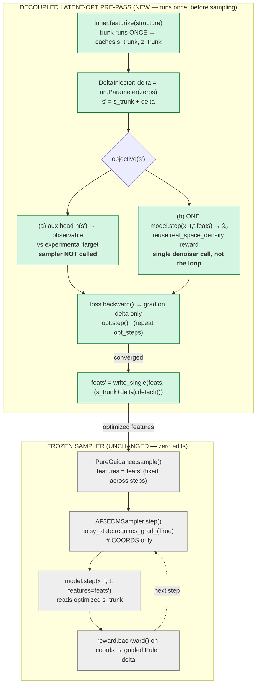

# Latent-space optimization across AF3-style wrappers

> Consolidated analysis + final recommendation for doing **AF2/OpenFold2-style
> latent-space optimization** (single representation and/or MSA representation)
> on the RF3, Protenix, and Boltz wrappers in `sampleworks`.
>
> Companion to `latent_adapter.py` and the solution diagrams in this folder.
> All upstream claims below were verified by reading the original source
> (OpenFold `evoformer.py`, Protenix `pairformer.py`/`protenix.py`, Boltz
> `trunkv2.py`/`pairformer.py`), not summaries.

---

## 1. The core architectural fact

In **AF2 / OpenFold2** the single representation and the MSA are *the same
persistent latent*:

```python
# openfold/model/evoformer.py:984 / :1062
s = self.linear(m[..., 0, :, :])      # single rep = Linear of MSA row 0
return m, z, s                         # m and z carried through all 48 blocks
```

In the **AF3 family (RF3 / Protenix / Boltz)** this is no longer true. Two
properties hold in every one of them:

1. **The MSA module writes only to `z`, never to `s`.**
   - Protenix `MSAModule.forward(...) -> z`; the internal `msa_sample` is
     discarded (`pairformer.py:916`). Its only coupling to the rest of the
     network is `z = z + OuterProductMean(m)` (`pairformer.py:660`).
   - Boltz `MSAModule.forward(...) -> z` (`trunkv2.py:669`); `MSALayer` does
     `z = z + outer_product_mean(m)` (`trunkv2.py:751`).
2. **The single representation is updated inside the Pairformer, independent of
   the MSA**, via pair-biased attention:
   - Protenix: `s = s + attention_pair_bias(a=s, z=z); s = s + single_transition(s)`
     (`pairformer.py:217-223`).
   - Boltz: `s = s + attention(s, z); s = s + transition_s(s)`
     (`pairformer.py:107-111`).
   - It is seeded from `s_inputs` (which folds in the MSA `profile` +
     `deletion_mean` summary), **not** from MSA row 0.

So `m` is a **transient, mid-trunk** tensor: rebuilt fresh from features every
recycle, used to enrich `z`, then dropped. **MSA reaches the single rep only
indirectly, through `z`.**

### The reframe that matters

`return z` is **information transfer, not destruction.** Latent-space
optimization optimizes *information*, and after the MSA module the MSA
information lives in `z` (and then propagates into `s` via the Pairformer).
Therefore the optimization targets are the **post-trunk latents** the wrapper
already caches:

| AF2 / OpenFold2 lever | Equivalent here |
|---|---|
| optimize single rep `s` | optimize **`s_trunk`** (post-Pairformer single) |
| optimize MSA `m`        | optimize **`z_trunk`** (where MSA info is encoded) |
| persistent, separable   | entangled in `z`/`s`, exposed only post-trunk |

`m` itself is the **wrong target**: it sits *upstream* of the
`featurize`→`step` boundary, so touching it forces a trunk re-run; it is rebuilt
each recycle (so an injected value is overwritten); and the trunk runs under
`no_grad`. Reserve direct `m` optimization for on-manifold steering *through*
the MSA nonlinearity (AfDesign / ColabDesign-style backprop-through-trunk with
`N_cycle=1`) — not for this work.

---

## 2. How the pipeline consumes the latent

```
PureGuidance.sample()                       # pure_guidance.py
  features = model.featurize(structure)     # ← runs the trunk ONCE; caches s_trunk/z_trunk
  for i in range(num_steps):
      AF3EDMSampler.step(state, model, ctx, features=features)
          noisy_state.requires_grad_(True)              # edm.py:420  ← COORDS are the grad var
          x_hat_0 = model.step(noisy_state, t, features)# edm.py:426  ← latent passed as constant
          guidance = reward.backward() on coords        # guidance flows through coordinates only
```

Two consequences:

- The latent (`features.conditioning`) is **fixed across all sampling steps**.
- The existing guidance is **coordinate-space** (classifier/DPS-style); it never
  differentiates w.r.t. the latent.

⇒ **Latent optimization must be a separate, decoupled pass that produces an
optimized `features`, after which the sampler runs unchanged.** This is exactly
the seam `latent_adapter.py` already occupies.

---

## 3. Which model is easiest (AF2-style, post-trunk latent)

| Model | `s_trunk` (single) | `z_trunk` (MSA-info) | direct `m` | Main blocker | **Verdict** |
|---|---|---|---|---|---|
| **RF3** | ✅ clean — `step()` reads it directly, no detach, no extra cache | ✅ clean | ❌ opaque generator trunk, `no_grad`, bf16 | bf16 / EMA-shadow; opaque trunk for `m` | **Easiest** |
| **Boltz1** | ✅ clean — no precomputed cache, no detach | ✅ clean | ⚠️ loop inline (hookable) but `m` rebuilt each recycle | none for post-trunk | **Easiest** |
| **Protenix** | ⚠️ `step()` **detaches** conditioning latents when grad on (`protenix/wrapper.py:676-681`) — bypass for your leaf | ⚠️ + recompute cached `pair_z`/`p_lm`/`c_l` (`:600-624`) | ❌ opaque `get_pairformer_output`, `no_grad` | detach in `step()` + z-derived caches | **Medium** |
| **Boltz2** | ⚠️ **partial** — `s_trunk` baked into cached `diffusion_conditioning` (`boltz/wrapper.py:819-826`); a boundary injection only reaches the `s_trunk` arg, not `q/c/biases` | ❌ must recompute `diffusion_conditioning` (depends on `s` **and** `z`) | ⚠️ loop inline but same rebuild issue | `diffusion_conditioning` cache | **Hardest** |

`DEFAULT_SINGLE_REP_ATTR` (in `latent_adapter.py`): Boltz=`s`, Protenix/RF3=`s_trunk`.

The split between "easy" and "hard" is entirely about **speed caches**: Protenix
and Boltz2 hoist diffusion conditioning out of the trunk and cache it so
`step()` is cheap. Those caches must be bypassed (detach) or recomputed for an
optimized latent to actually reach the denoiser. RF3 and Boltz1 cache nothing
extra, so the optimized latent flows straight through.

---

## 4. Final recommendation

**Optimize the cached post-trunk latent in a decoupled pre-pass; keep diffusion
a frozen sampler.** Concretely:

### 4.1 Target and mechanism
- **Target:** `s_trunk` first (single rep; reuses the existing adapter seam and
  propagates cleanly on RF3/Boltz1). Add `z_trunk` only when the explicit
  MSA-information lever is needed.
- **Mechanism:** a **direct additive latent perturbation** — the most direct
  form of latent-space optimization:

  ```python
  class DeltaInjector(nn.Module):
      """Direct latent-space optimization: a free additive perturbation."""
      def __init__(self, shape):
          super().__init__()
          self.delta = nn.Parameter(torch.zeros(shape))   # identity at init
      def forward(self, x):
          return x + self.delta
  ```
  `delta` starts at zero (preserves the zero-impact guarantee), is the
  optimization variable, and is regularized (`‖delta‖`) to stay on-manifold.
  Use `training_adapter=True` so it is **not** detached during the optimization
  pass.

### 4.2 Objective (diffusion stays a sampler)
Pick by available signal, neither unrolls the sampler:
- **(a) Auxiliary-head / AlphaSAXS objective (preferred):** a small
  differentiable head `h(latent) → predicted observable`, optimized against the
  experimental target. The sampler is **never** called during optimization; it
  runs once at the end to decode the optimized latent.
- **(b) Single-denoiser-call objective:** call `model.step(x_t, t, features)`
  **once** (one `x̂₀` evaluation, not the loop) as a cheap differentiable
  decoder, reuse the existing reward (`rewards/real_space_density.py`), backprop
  to `delta`. Minimal coupling that still yields coordinate-space rewards.

### 4.3 Integration (zero edits to the sampler)
```
LatentOptimizer (NEW, decoupled pre-pass)
  feats = inner.featurize(structure)            # trunk once
  delta = DeltaInjector(s_trunk.shape)          # leaf params
  for _ in range(opt_steps):
      s' = s_trunk + delta
      loss = objective(s')                       # (a) head  or  (b) one step() call
      loss.backward(); opt.step()                # grad → delta only
  feats' = write_single(feats, (s_trunk+delta).detach())
  return feats'                                  # hand to PureGuidance.sample() unchanged
```

### 4.4 Start here
- **RF3 or Boltz1**, `s_trunk`, `DeltaInjector`, objective (a). Zero model
  surgery, no trunk re-run, frozen sampler, clean gradient.
- Then `z_trunk` for the MSA-information lever.
- **Guards** (carry over from the downstream-impact diagram): clamp `‖delta‖` to
  avoid OOD/NaN `x̂₀`; for **Protenix** skip the `step()` detach for the leaf and
  recompute `pair_z`/`p_lm`/`c_l` if perturbing `z`; for **Boltz2** recompute
  `diffusion_conditioning` after injection or the perturbation is partially
  ignored.

---

## 5. Existing implementations / prior art
- **Backprop-through-a-folding-model to optimize the MSA/sequence input** is what
  **ColabDesign / AfDesign** does for AF2 — the precedent for true `m`/input
  optimization, and it confirms the full-trunk-backprop cost profile.
- **In this repo:** the only latent-optimization scaffold is the single-rep
  injection in `latent_adapter.py`. No `m` path exists; no wrapper exposes `m`.
- Diffusion-model guidance in this space is otherwise coordinate-space
  (the existing `PureGuidance` / `AF3EDMSampler` path).

---

## 6. Visualization — the finalized decoupled design



**Read:** the trunk runs once; `delta` (the additive latent perturbation) is the
only optimization variable; the objective avoids unrolling the sampler; the
optimized latent is detached and handed to the **unchanged** sampler. `m` never
appears — its information is already inside `s_trunk`/`z_trunk`.

## 7. Diagrams (Graphviz)
A `build_final_recommendation()` was added to `generate_solution_diagram.py`
(render with `pip install graphviz` + system `dot`). See also the existing
figures in this folder:
- `latent_adapter_solution[_step1].svg` — the injection seam & pipeline.
- `latent_adapter_solution_downstream.svg` — what a swapped `s'` affects
  downstream (intended / invariant / indirect / risk).

The **Step 2** nodes in that diagram (MLP/FiLM/Density injector, `LatentGuidance`
with `training_adapter=True`, one-step-denoiser proxy) are precisely the
`DeltaInjector` + decoupled-objective design finalized in §4.
